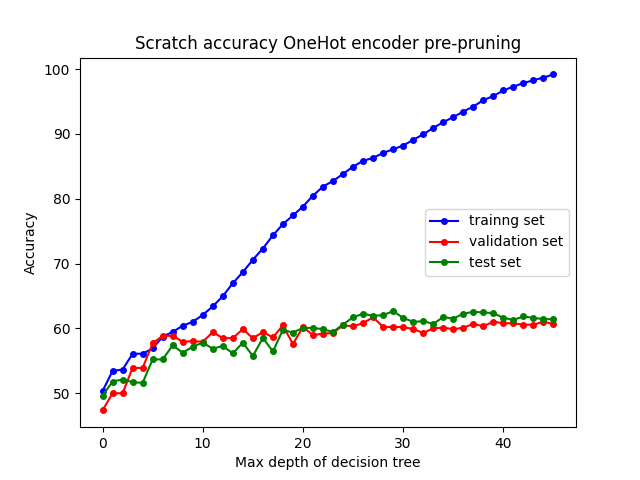
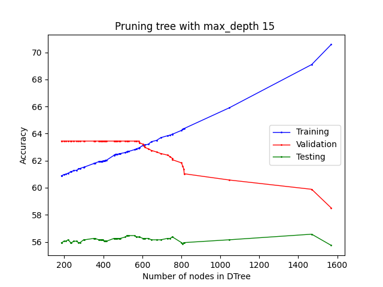
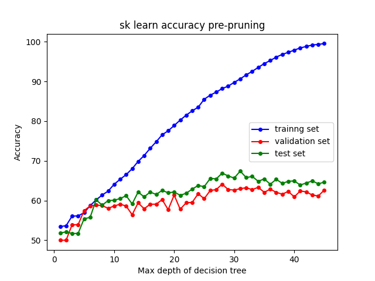

# Problem 1 : Decision Trees

### Dataset
* There are 12 festures total

* Categorial $[8]$: `[team, opp , host, month, day_match , toss, bat_first, format]`
* These take `[19 , 19 , 19, 12 , 3 , 2 , 2 , 2]` distinct values respectively
* Continuous $[4]$: `[year, fow, score, rpo]` 
* Out of the above, `[team, opp , host, month, day_match]` need label encoding
* After `OneHOT` encoding there are total $75$ Categorial features and $4$ continuous features.
* Training data size: $7827$
* Validation data size: $870$
* Testing data size: $967$

### Splitting a node (Categorial Feature)
* We want to decide the parameter of split and also the threshold. 

$$ H(Y) = \sum_{y} -P(y) * log(P(y))$$

$$H(Y | X_j = x_j) = \sum_{y} -P(y | X_j = x_j) * log(P(y | X_j = x_j))$$

$$H(Y | X_j) = \sum_{x_j} P(X_j = x_j) * H(Y | X_j = x_j)$$

$$I(Y | X_j) = H(Y) - H(Y | X_j)$$

* In `Scratch`, while deciding split at a node, `all features` are considered (here the number of features is already too small) and feature corresponding to the minimum $I(Y | X_j)$, or equivalently maximum $H(Y | X_j)$ is used to split. {As $H(Y)$ is same for every $X_j$}
  
* For Continuous Features, above is done by splitting across the median

* Problem faced while using Ordinal Endoding is that: In some cases, say a feature $X_j$ has possible values $x_1 , x_2....x_k$ and a possible split by this feature leaves $0$ examples with the feature $x_p , 1 \leq p \leq k$, in this case $H(Y | X_j = x_p)$ is considered $\infty$ and a split is never made using this feature. 

* We stop splitting in one of these cases only:
  
1) Pure leaf is reached. All examples have the same $Y$ label
2) `MAX_DEPTH` is reached
3) There is no valid feature left to split. `Valid` explained in the above paragraph.

Note: (3) was never encountered on the given dataset

* Prediction: On a test example, on reaching the leaf $Y_{predicted}$ is the majority label in $X_{train}$ limited to that leaf only.

### (a) Decision Tree: Ordinal Encoding

* Note that here there was no use of Validation set in training as there were no hyper-parameters in this implementation. Both 
$(X_{validation} , Y_{validation})$ and $(X_{test}, Y_{test})$ can be treated as test sets. 

* Accuracy (%) 
  
|Set|Only win | Only loss|
|:-:|:-:| :-:|
|Training| $50.339$|$49.661$|
|Validation|$47.356$|$52.644$|
|Testing| $49.638$|$50.362$|

* Accuracy by Decision Tree (%)

|max_depth |Training Set| Validation Set| Test Set| 
|:-:        |:-:        |:-:            |:-:      |
|$0$| $50.339$|$47.356$ | $49.638$|
|$5$| $77.871$|$61.034$| $59.255$|
|$10$| $99.847$|$60.920$|$58.221$|
|$15$ | $100.000$|$61.034$|$58.118$|
|$20$|  $100.000$| $61.034$| $58.118$|
|$25$|$100.000$|$61.034$|$58.118$|


* In both $(X_{validation} , Y_{validation})$ and $(X_{test}, Y_{test})$, Decision Tree does $\approx 10$% better than `Only win` and `Only loss` prediction. 
* Notice that `max_depth = 0` exactly matches with `Only Win` cases. This is because the training set has more `Win` samples than `Loss` samples 

* With increasing `max_depth`, accuracy values soon saturates. In Ordinal Endoding we use `k-way splits` and hence the tree had more width and less height, compared to `OneHot` Encoding case. 
* Validation set attains maximum accuracy at `max_depth = 5` and later-on it remains constant (ignoring fluctuations) irrespective of `max_depth`
* Given sufficient `max_depth`, the Decision Tree is able to `perfectly` `pack in` the training set. This is `overfitting`, clearly indicated by the much lower Validation Accuracies
  
<p align="center">

</p>


### (b) Decision Tree One Hot Encoding

* Note that here there was no use of Validation set in training. Both $(X_{validation} , Y_{validation})$ and $(X_{test}, Y_{test})$ can be treated as test sets. 
* Accuracy (%) : Pre-Pruning

|`max_depth` |Training Set| Validation Set| Test Set| 
|:-:        |:-:        |:-:            |:-:      |
|$0$|$50.339$|$47.356$|$49.638$|
|$5$|$56.906$|$57.701$|$55.222$|
|$10$|$62.080%$| $57.931$|$57.808%$|
|$15$ |$70.589%$|$58.506$|$55.739$|
|$20$|$78.804%$|$60.230$|$60.083%$|
|$25$|$84.950$|$60.345$|$61.737$|
|$35$|$92.603$|$59.885$|$61.531$|
|$45$| $99.182$|$60.690$|$61.427$|


* For the same `max_depth` (before saturation), `Ordinal encoded` tree offers better training accuracy than `OneHot encoded` tree. This is because the former has more width and packs more information about the $(X_{train} , Y_{train})$ in the same depth.
* Accuracy values are almost the same as `Ordinal encoded` trees.
* Validation set accuracy achieves maximum at `max_depth = 40` approximately which can also be seen in the below graph (ignoring fluctuation) 
  

<p align="center">

</p>


### (c) Decision Tree Post Pruning

* In a single iteration of pruning, all non-leaf node in the Decision Tree are `hypotheticaly`, pruned, i.e. all nodes in the subtree of the chosen node are removed, except the node itself. Accuracy on Validation Set is calculated. The node corresponding to maximum `increase` on validation accuracy is used to actually prune. This is continued till pruning of any node, `strictly decreases` the validation accuracy.
* Implemented a fast algorithm for pruning that took $\mathcal{O}(x)$ time per iteration, where $x$ is the current number of nodes in the tree. This does not need to iterate over the entire validation set in each iteration. Verified it against the naive method for correctness.
  
* Note: Post-pruning results might vary slightly with each run. At any stage during purning, there can be many `nodes`, at which pruning will offer the exact same maximum improvement in accuracy improvement on $(X_{val} , Y_{val})$. The `node` to prune at, is `randomly` chosen in such cases. For example, $\{8 , 8 , 8 , 6 , 6 , 3 , 1\}$ giving the number of more examples in $X_{val}$ thare are correctly classified by pruning.


| `max_depth` | Intial Size | Final Size |  Number of Iterations |
| :-:         | :--:        | :--:        |  :-:|
|$15$         | $1569$      | $185$|  $61$|
|$25$         | $3395$      |$367$ | $190$|
|$35$         |  $4431$     | $529$| $292$|
|$45$         |$5469$       |$637$ |$320$|

### Training Set Accuracy (%)

| `max_depth` | Pre-pruning | Post Pruning | 
| :-:         | :--:        | :--:         | 
|$15$         | $70.589$   | $63.448$| 
|$25$ | $84.950$         |$66.398$ | 
|$35$|  $92.603%$| $68.724%$| 
|$45$ |$99.182$      |$70.167%$ |

### Validation Set Accuracy (%)

| `max_depth`     | Pre-pruning    | Post Pruning | 
| :-:      | :--:           | :--: | 
|$15$ | $58.506%$         | $63.448%$| 
|$25$ | $60.345$         |$68.736$ | 
|$35$|  $59.885$| $72.529$| 
|$45$ |$60.690$      |$74.138$ |

### Test Set Accuracy (%)

| `max_depth`     | Pre-pruning    | Post Pruning | 
| :-:      | :--:           | :--: | 
|$15$ | $55.739$         | $55.946$| 
|$25$ | $61.737$         |$59.876$ | 
|$35$|  $61.531$| $60.290$| 
|$45$ |$61.427%$      |$60.703%$ |

* Training set accuracy clearly decreases on further pruning. This is reducing overfitting. Decision Tree, is an unstable learner and without pruning is hightly susecptible to overfitting. 
* Validation set accuracy increases with pruning, by design of the algorithm
* Validation set accuracy becomes constant in the later part during pruning, the tree size just keeps reducing. Pruning is continued at this stage to save computation during prediction.
* Test set accuracy, in the last 3 cases infact `decreases` post pruning. This indicated that `excessive` pruning can lead to `loss` of information and increasing `bias`
* In the below graph, It can be seen that Test Set accuracy attains a maximum in between (the values in above table are at the `end of pruning` but we can't use Test set accuracies to influence out training process
* Difference in Test set accuracies post pruning, against `max_depth` is not large in the last 3 rows. Both Post Pruning Test and Validation accuracies incease with `max_depth`


<p align="center">


  </p>
<p align="center">


</p>

### (d) Decision Tree sci-kit learn

* Note that Validation Set was not used in training, so it can be treated as test set.
* `max_depth` vs Accuracy (%) 

|`max_depth` |Training Set| Validation Set| Test Set| 
|:-:       |:-:         |:-:            |:-:      |
|$15$ |$71.343$|$57.931$|$60.910$|
|$25$|$85.499$|$60.460$|$63.495$|
|$35$|$94.493$|$62.069$|$65.460$|
|$45$|$99.540$|$62.644$|$64.633$|


<p align="center">
    
</p>

* `ccp_alpha` vs Accuracy (%) 

|`ccp_alpha` |Training Set| Validation Set| Test Set| 
|:-:       |:-:         |:-:            |:-:      |
|$0.001$ |$68.213$ | $64.368$| $64.116$|
|$0.01$| $50.339$|$47.356$|$49.638$|
|$0.1$| $50.339$|$47.356$|$49.638$|
|$0.2$|$50.339$|$47.356$| $49.638$|
  
<p align="center">
    
</p>

* The best validation/ test performance is  at `max_depth = 35` corresponding to a an accuracy of $\approx 65.460$%
* The best validation/ test performance is  at `ccp_alpha = 0.001` corresponding to a an accuracy of $\approx 64.386$%
* In `scratch` the best best pre-pruning validation accuracy corresponds to `max_depth = 45` that has a test accuracy of $\approx 61.427$%. The best post-pruning validation also corresponds to `max_depth = 45` that has a test accuracy of $\approx 60.703$%.
* SK-learn's model performs somewhat better. 


### (e) Grid Search 

* `sk learn`'s `GridSearchCV` by default does `k-fold cross validation` on the input data. Changed this mode to train on $(X_{train} , Y_{train})$ cross validation using $(X_{val} , Y_{val})$
* "The out-of-bag (OOB) error is the average error for each  calculated using predictions from the trees that do not contain  in their respective bootstrap sample. This allows the RandomForestClassifier to be fit and validated whilst being trained." : Source (https://scikit-learn.org)
* Grid Search is exhaustive and tests every possible combination of the hyper-paramters from the input search space
* The search space was

```
    PARAM_GRID = {
    n_estimators: [50 , 100 , 150 , 200 , 250 , 300 , 350],
    max_features: [0.1 , 0.3 , 0.5 , 0.7 , 0.9 ,  1.0],
    min_samples_split: [2 , 4 , 6 , 8 , 10]
    }
```
* Final Hyper-parameters obtained:
```
    - max_features: 0.7
    - min_samples_split = 8 
    - n_estimators = 100
```


* The exhaustive search takes a lot of time. The above `forests` consist of total $15,400$ different trees to train and botstrapping. 
* Best `Out-Of-Bag (OOB)` accuracy = $71.795$%
    
| Set      | Accuracy (%)|
| :-:      | :--:           |
|Training  | $97.675$         |
|Validation| $97.126$         |
|Testing   | $70.734$         |

* Note that the above results came out different, with slight change in accuracies ($1$% - $2$%) each time the program runs, giving a different set of best hyper-parameters

* These acuracies ($\approx 70$% test) are higher than the previous ones ($\approx 65$% by sk-learn and $\approx 60$% by scratch) , but note that these are `Random Forestes` and get the advantage of `ensembling` which reduces learning `variance` compared to simple decision trees.


* Various Data points in the search space are plotted here
<p align="center">
    
</p>
