# Problem 2 : Neural Networks

## Terminology
* Total number of layers: $L$ namely $l_1$, $l_2$...... $l_L$
* $l_0$ is the input layer. It outputs $n^0$ paramters which are the input features (including the constant $x_0 = 1$ for the `bias` term)
* $l_1 , l_2.....l_{(L-1)}$ are hidden layers
* $l_L$ is the output layer
* Layer $l_i$ has $n^{(i)}$ perceptrons
* Output of each perceptron in $l_i$ (hence total $n_l$ in number) are fed into each perceptron in $l_{i+1}$
* $\theta_k^{(l)}$: paramter of $k^{th}$ ($1 \leq k \leq n_l$) perceptron in the $l^{th}$ ($1 \leq l \leq L$) layer. It is a **vector** of size $n_{l-1}$
* $o_k^{(l)}$ is output of $k^{th}$ ($1 \leq k \leq n_l$) perceptron in the $l^{th}$ ($1 \leq l \leq L$) layer($0 \leq o_k^{(l)} \leq 1$)
* $o^{(l)} = (o_1^{(l)} , o_2^{(l)},....o_{n^{(l)}}^{(l)})^T$ is a vector of size $n^{(l)}$
* $net^{(l)}_k$ is the net linear combination, inside $k^{th}$ ($1 \leq k \leq n_l$) perceptron in the $l^{th}$ ($1 \leq l \leq L$) layer given as
  
  $$net_k^{(l)} = \sum_{j = 1}^{n^{(l-1)}} o_j^{(l-1)} \theta_{kj}^{(l)} = (\theta_k^{(l)})^To^{(l-1)}$$


* The perceptron output is given as:
$$o_k^{(l)} = g(net_k^{(l)})$$

## Backpropagation:  Derivation

* When $g$ is the **sigmoid**, we get
$$\frac{\partial o_k^{(l)}}{\partial net_k^{(l)}} = o_k^{(l)} * (1-o_k^{(l)})$$
* Also we define 
$$\frac{\partial J}{\partial net_k^{(l)}} = -\delta_k^{(l)}$$
* Keep in mind that $\delta_k^{(l)}$ is a scalar
* For gradient descent to obtain optimal $\theta_k^{(l)}$'s we'll need $\nabla_{\theta_{k}^{(l)}}J$
* Using chain rule we get
$$\nabla_{\theta_k^{(l)}}J = \nabla_{net_k^{(l)}}J * \nabla_{\theta_k^{(l)}} net_k^{(l)}$$
* which gives us 
$$\nabla_{\theta_k^{(l)}}J =   -\delta_k^{(l)} * \nabla_{\theta_k^{(l)}} net_k^{(l)}$$
* Noticing that 
    $$\nabla_{\theta_k^{(l)}} net_k^{(l)} = o^{(l-1)}$$
* We finally get 
$$\boxed{\nabla_{\theta_k^{(l)}}J =   -\delta_k^{(l)} * o^{(l-1)}}$$
* Now to obtain $\delta_k^{(l)}$
$$\nabla_{net_k^{(l)}}J = \nabla_{o_k^{(l)}}J\frac{\partial o_k^{(l)}}{\partial net_k^{(l)}}$$
* Taking $g$ as the sigmoid, we get 
$$-\delta_k^{(l)} = \nabla_{net_k^{(l)}}J = \nabla_{o_k^{(l)}}J * o_k^{(l)} * (1 - o_k^{(l)})$$

* $o_k^{(l)}$ affects $J$ through $\{net_j^{(l+1)}\}$ for $j = 1 , 2 ... n^{(l+1)}$ which gives us
$$\nabla_{o_k^{(l)}}J = \sum_{j = 1}^{n^{(l+1)}} \nabla_{net_j^{(l+1)}}J *  \frac{\partial net_j^{(l+1)}}{\partial o_k^{(l)}}$$
* simplifying to
  
$$\nabla_{o_k^{(l)}}J = \sum_{j = 1}^{n^{(l+1)}} -\delta_j^{(l+1)} * \theta_{jk}^{(l+1)}$$
* finally giving us the iteratve rule for Back Propagation:
$$\boxed{\delta_k^{(l)} = [\sum_{j = 1}^{n^{(l+1)}} \delta_j^{(l+1)} * \theta_{jk}^{(l+1)}]* o_k^{(l)} * (1 - o_k^{(l)})}$$
* and
$$\boxed{\nabla_{\theta_k^{(l)}}J =   -\delta_k^{(l)} * o^{(l-1)}}$$
* $o_k^{(l)}$ values are first obtained during forward propagation, then $\delta_k^{(l)}$ values during backward propagation
* Base case: $o_k^{(0)}$ are the values of input features
* $\delta_k^{(l)}$ values are first obtained from the last layer during back propagation as shown below.

* Note that in our implemetation, in the last layer, $net_k^{(L)}$ is not passed into the **sigmoid**, rather, $o_k^{(L)}$ is generated as:


$$o_k^{(L)} = \frac{e^{net_k^{(L)}}}{\sum_{j} e^{net_j^{(L)}}}$$


* When solved, it gives:

  
$$ \delta_k^{(L)} = $$  

$$1 - o_k^L  &ensp; if  &ensp; k = \bar{k}$$

$$-o_k^L   &ensp; otherwise$$


* Here we derived for just a single training example with true label $\bar{k}$. For a batch of greater size, these results are to be averaged over each example in the (mini) batch

  

## Data:

* Train data class frequencies (total $10000$): 
$$\{1971, 1978, 1952, 2008, 2091\}$$
* Test (total $1000$)
$$\{229, 198, 199, 187, 187\}$$
* Both the datas are `balanced`. Each class has an almost equal population


### (a) Stochastic Gradient Descent: Hidden Layer Architecture {100 , 50}
  
* Used constant learning rate. Note that $n$ below includes the bias term $x_0 = 1.0$.
* $H$ denotes hidden layer architecture
$$M = 32$$
$$\eta = 0.01$$
$$n = 1025$$
$$H = \{100,  50\}$$
$$K_{prev} = 400$$

* Each of $\theta^{(l)}_{kj}$ is initialised from Random Normal Distribution with mean $0$ and vairance $\sigma^2$ that was adjusted for convergence. $\sigma^2 \approx 0.05$ worked for all. 
* We move over $(X_{train} , Y_{train})$ in a robin fashion, in batch sizes of $M$. One complete traversal over the data is considered an `epoch`.
* $J_{mini}$ is Loss funciton is the `averaged` over all examples in the mini batch.  
* Error of a mini match $J_{mini}$, averaged over $1$ `epoch` is called $J_{avg}$

* Experimeted with value of gradient (max norm) after iteration but even after the cost $J_{avg}$ falls subtantially, the max norm of gradient is no-where close to say, $10^{-4}$. The $J_{avg}$ cost, though does fall in this time. 

### Convergence Criteria

* It was found that $J_{avg}$ keeps on decreasing even after $8000$ epoches. Setting a criteria like difference of $J_{avg}$ in $2$ successive epoches be less than $10^{-4}$ for convergence `gives too early` stopping. In this example, the final `Loss` after $8000$ epoches was 
    $$J_{avg} = 0.002427077703840211$$
it's difference with the previous epoch was

$$J_{avg}^{7999} - J_{avg}^{8000} = 7.4 * 10^{-7}$$

* The amount of time taken though for this is infeasible to be run on ever other architecture below. In the following graph we can see the convergence of $J_{avg}$ and saturation of training accuracy to $100$% 


<p align="center">
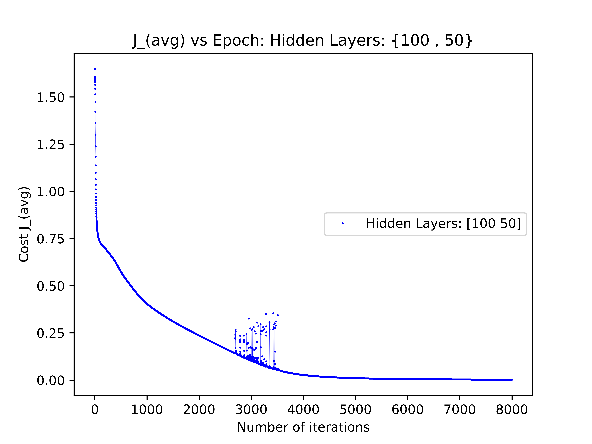
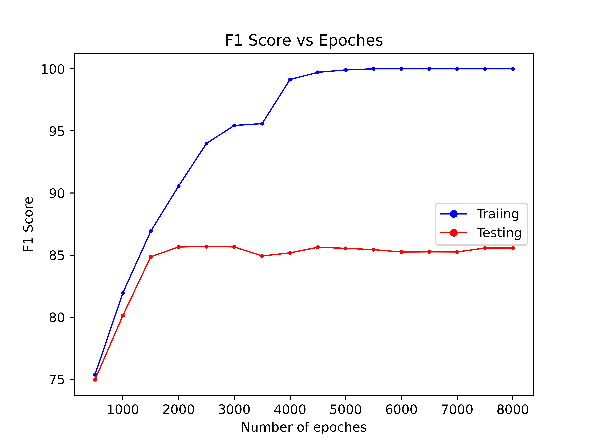
</p>

* F1 Score vs Number of Epoches (%)

|Epoches| Training| Testing|
|:-:|:-:|:-:|
|$500$|$75.367$|$74.967$|
|$1000$|$81.956$|$80.129$|
|$1500$|$86.914$|$84.859$|
|$2000$|$90.552$|$85.654$|
|$2500$|$93.989$|$85.681$|
|$3000$|$95.437$|$85.659$|
|$3500$|$95.587$|$84.926$|
|$4000$|$99.139$|$85.178$|
|$4500$|$99.720$|$85.628$|
|$5000$|$99.910$|$85.542$|
|$5500$|$100.000$|$85.436$|
|$6000$|$100.000$|$85.248$|
|$6500$|$100.000$|$85.260$|
|$7000$|$100.000$|$85.254$|
|$7500$|$100.000$|$85.562$|
|$8000$|$100.000$|$85.563$|

* As clearly indicated by the `Loss` value shoun above, this achieves $100$% training accuracy.


## (b) Varying Layer Width on Single Hidden Layer Architecture


<p align="center">
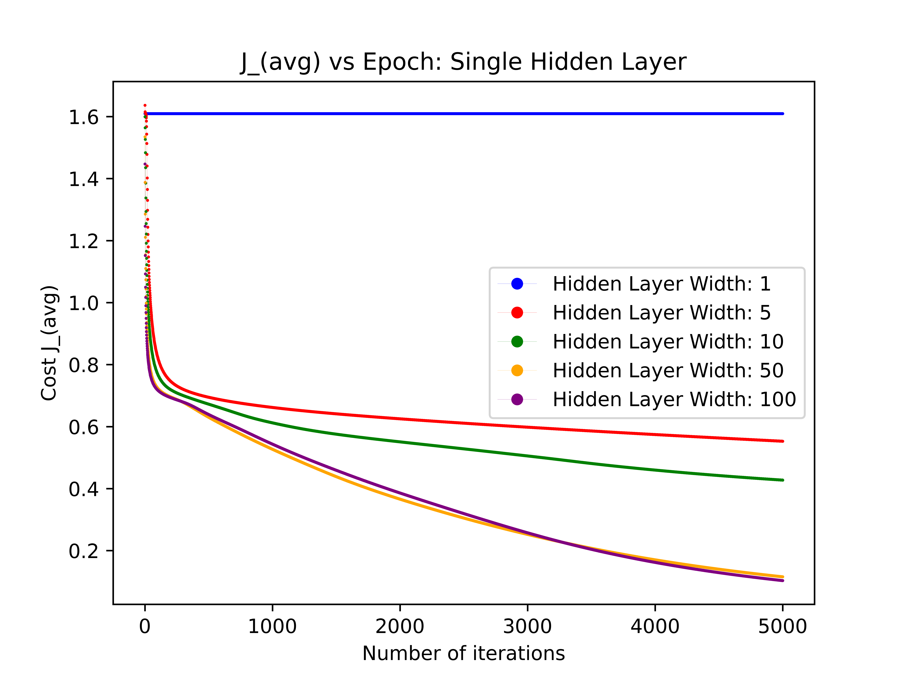
</p>


* Using `sk learn :: classification_report()`, `weighted` average of `Precision`, `Recall` and `F1_socre` are reported, but they aren't far from `unweighted` values as the count of each class is almost the same i.e. both `train` and `test` data are `balanced`.
* After training for $5000$ epoches, we get:
* Training Data Scores (%):

|Width| Precision|Recall| F1 Score|
|:-:|:-:|:-:|:-:| 
|$1$ |$100.000$|$19.710$|$32.930$|
|$5$ |$78.531$|$76.890$|$77.459$|
|$10$ |$83.148$|$82.000$|$82.306$|
|$50$ |$97.064$|$97.040$|$97.035$|
|$100$ |$97.878$|$97.860$|$97.866$|


* Testing Data Scores (%):

|Width| Precision|Recall| F1 Score|
|:-:|:-:|:-:|:-:| 
|$1$ |$100.000$|$22.900$|$37.266$|
|$5$ |$74.694$|$73.200$|$73.713$|
|$10$ |$78.272$|$77.300$|$77.551$|
|$50$ |$83.175$|$82.800$|$82.691$|
|$100$ |$82.624$|$82.200$|$82.292$|

<p align="center">
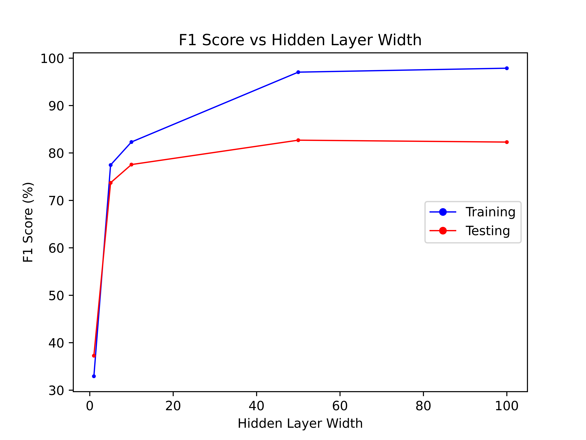
</p>

* The `F1 Score` for $\{1\}$ should be ignored. This classifies all the samples into the same class. This gives `zero division error` for calculation of `F1 Score`
* As expected, wider layer is able to better `absorb` the information in $(X_{train} , Y_{train})$ and gives better Scores

* Stopping Criteria: As explained in $(a)$, we need to limit the number of epoches. I tried monitoring the Training and Test Set F1 Score after each $1000$ epoches. Here are the results.


<p align="center">
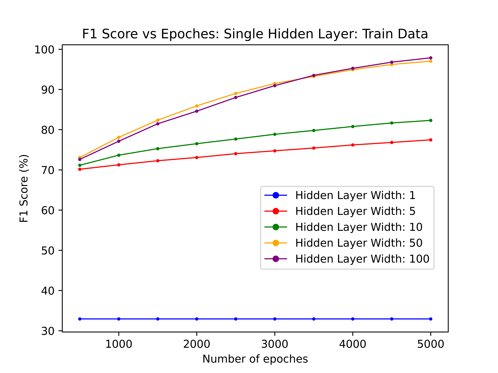
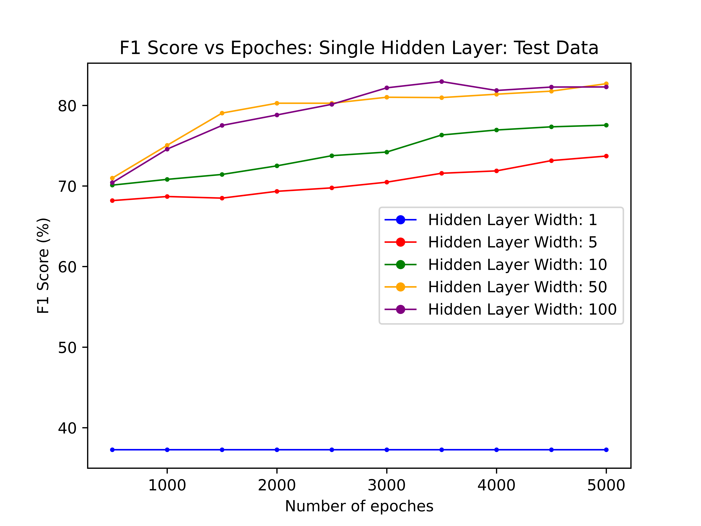
</p>

* While the Training Set Scores still seem to increase, the Test Set scores (which I intend to use as a Validation set here) look like getting saturated. This can be used a stopping criteria. A more clear version, can be seen in $(a)$ "F1 Score vs Epoches" there it's much clear that the Test (Validation) set F1 Scores saturate much earlier than Training Set F1 Scores

## (c) Varying Network Depth


<p align="center">
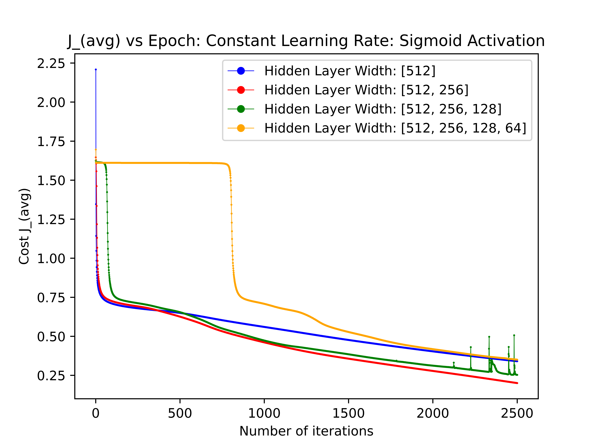
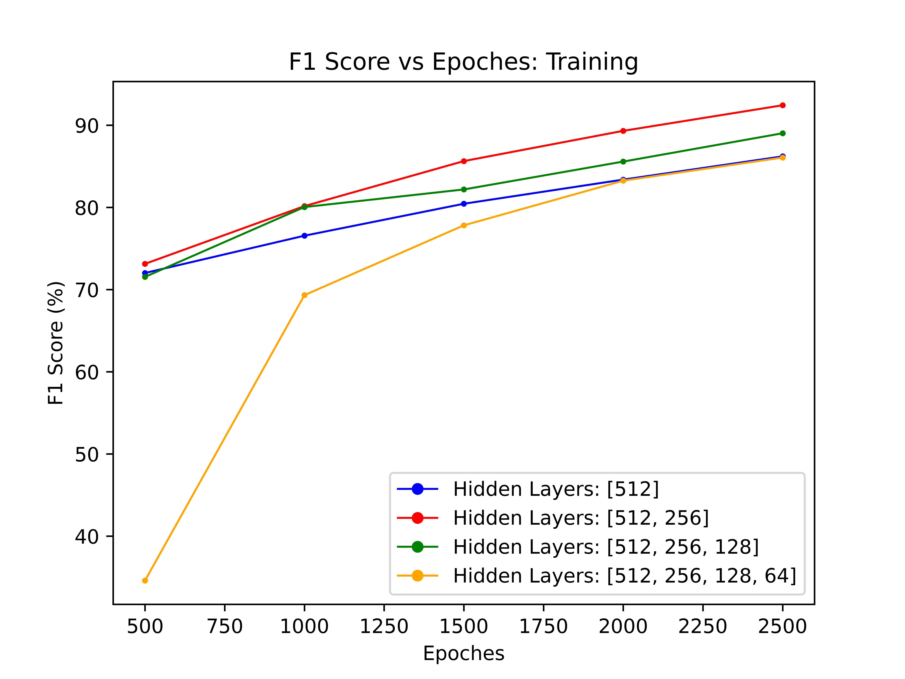
</p>

* In $[512 , 256 , 128 , 64]$ there's no change in $J_{avg}$ for atleast the first $500$ epoches. This is because it's a deeper network than the rest so the $X_{train}$ takes `longer` (more epoches) to propagate from $l_0$ to $l_L$ and $Y_{train}$ information takes `longer` to propagate from $l_L$ to $l_0$. The same pattern was obtained on running it repeatedly. 
* Further there's role of the `sigmoid` whoch gets saturated `too soon` on both sides of $0$ hence losing information while propagation. This drawback is handles well by ReLU (shown later)

* After training for $2500$ epoches, we get:
* Training Data Scores (%)

|Layers|Precision|Recall|F1 Score|
|:-:|:-:|:-:|:-:|
|$[512]$ |$86.706$|$86.080$|$86.213$|
|$[512, 256]$ |$92.449$|$92.440$|$92.434$|
|$[512, 256, 128]$ |$89.308$|$88.990$|$89.026$|
|$[512, 256, 128, 64]$ |$86.346$|$85.930$|$86.069$|

* Testing Data Scores (%)

|Layers|Precision|Recall|F1 Score|
|:-:|:-:|:-:|:-:|
|$[512]$ |$80.654$|$80.200$|$80.268$|
|$[512, 256]$ |$86.051$|$86.000$|$85.996$|
|$[512, 256, 128]$ |$82.687$|$82.500$|$82.504$|
|$[512, 256, 128, 64]$ |$82.095$|$82.000$|$82.029$|


### F1 Score vs Network Depth

<p align="center">
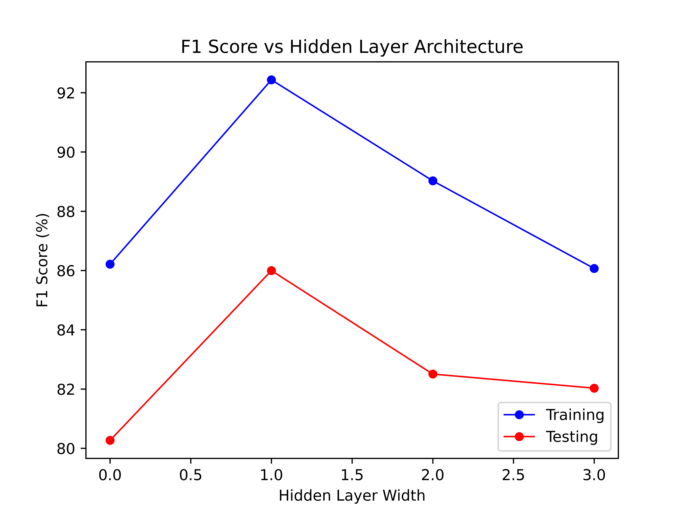
</p>

* Having trained all for the same number of epoches, we see $\[512,256\]$ offers the best `F1 Score`. $[512]$ loses probably because of the simplicity (bias) while $[512, 256, 128, 64]$ because of the loss of information with depth as explained above.
* Note that given a sufficient number of epoches, all these should be abble to attain much better Training scores (see $(a)$). But that time was infeasible to train all these networks


## (d) Adaptive Learning Rate

$$\eta_e = \frac{\eta_0}{\sqrt{e}}$$ 
where $e$ is the current **epoch** number


<p align="center">
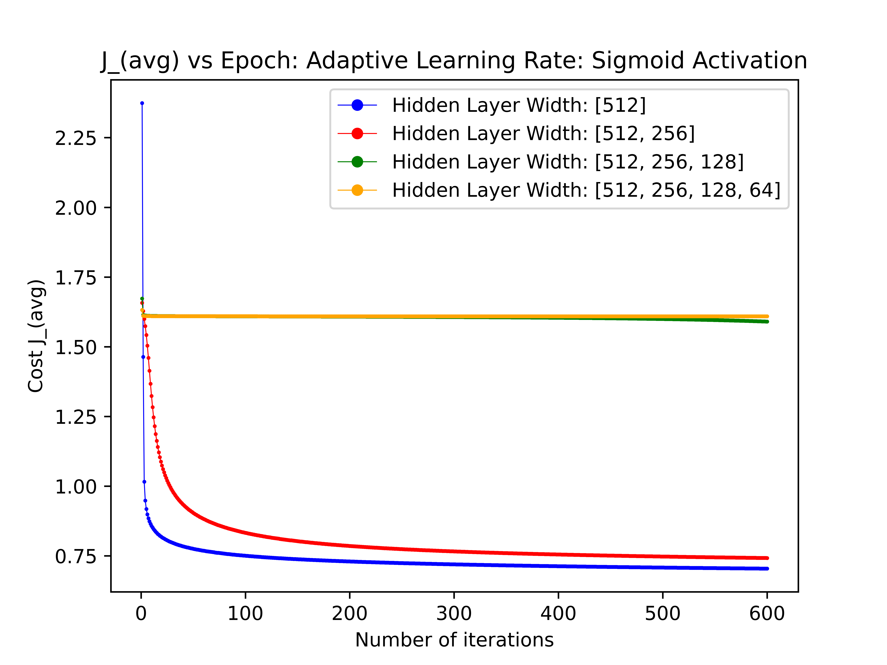
</p>

* After training for $500$ epoches

* Training Data Scores (%)

|Layers|Precision|Recall|F1 Score|
|:-:|:-:|:-:|:-:|
|$[512]$ |$70.473$|$69.080$|$69.604$|
|$[512, 256]$ |$67.617$|$66.460$|$66.939$|
|$[512, 256, 128]$ |$100.000$|$20.910$|$34.588$|
|$[512, 256, 128, 64]$ |$100.000$|$20.910$|$34.588$|

* Testing Data Scores (%)

|Layers|Precision|Recall|F1 Score|
|:-:|:-:|:-:|:-:|
|$[512]$ |$67.101$|$66.800$|$66.913$|
|$[512, 256]$ |$66.950$|$66.600$|$66.724$|
|$[512, 256, 128]$ |$100.000$|$18.700$|$31.508$|
|$[512, 256, 128, 64]$ |$100.000$|$18.700$|$31.508$|


* F1 Scores for last 2 rows should be ignored. These classfiers predicted all examples into the same class, F1 Score calculation gives  `zero division error`

### F1 Score vs Network Depth

<p align="center">
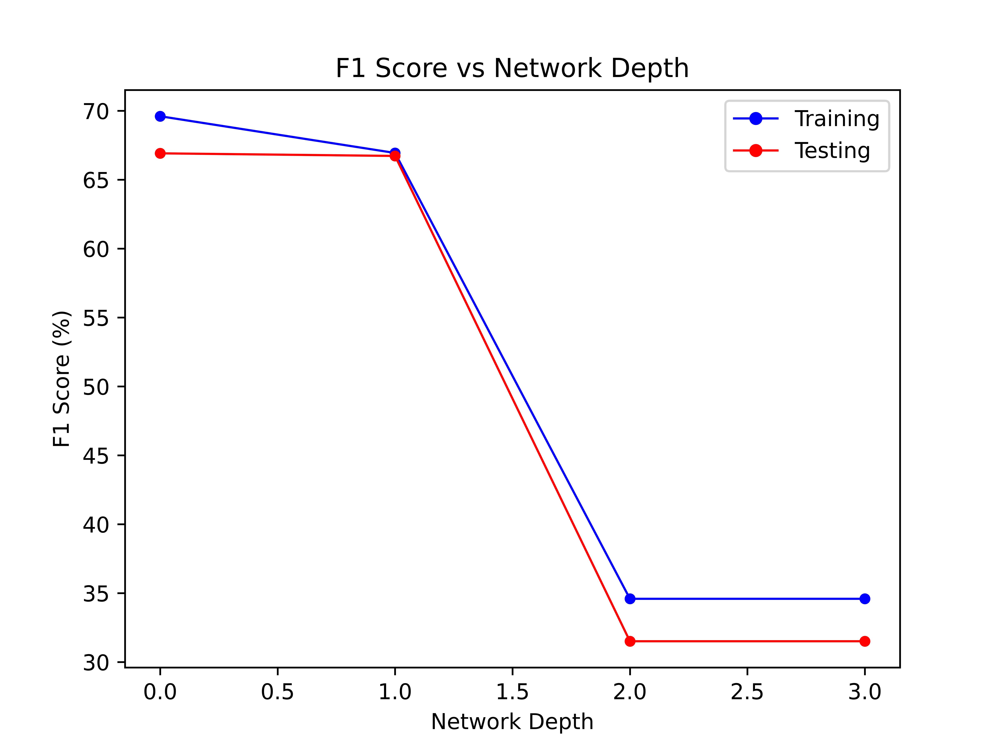
</p>


* While it looks like, from the graph of $J_{avg}$ vs Epoch that $J_{avg}$ converges, this is because the `step size` becomes too small beacuse $\eta$ becomes too small. These values as shown in $(e)$ after $500$ iterations are much smaller than in the constant $\eta$ case.

* A relative comparison of speed of convergence using adapted $\eta$ is given later in $(e)$
* The problem here is that, the given $\eta = \frac{\eta_0}{\sqrt{e}}$ falls to quickly, definitely not in sync with how $J_{avg}$ changes here. Which is why we see $[512, 256, 128, 64]$ and $[512, 256, 128]$ perform poorly.   

## (e) ReLU activation: Scratch

* The gradient for non negative values is $0$, and the slope for positive values is $1.0$.
* Initialisation is important. Even during descent, $||\theta^{(l)}||$ may become zero and the descent gets stuck. 
* It took $17$ trials for $[512, 256, 128, 64]$ to actually start Training correctly
  
<p align="center">
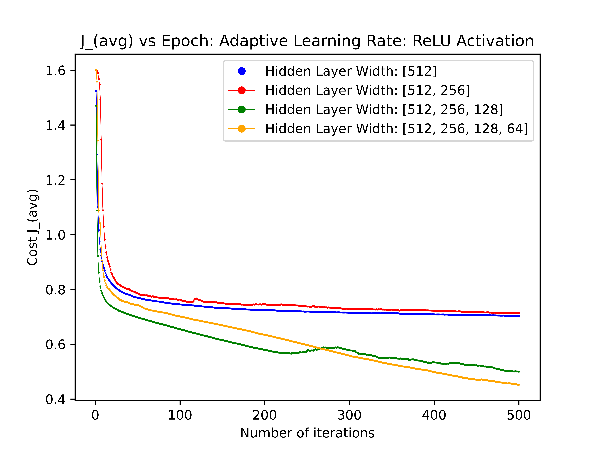
</P>

### Relative Convergence: Sigmoid vs ReLU

<p align="center">
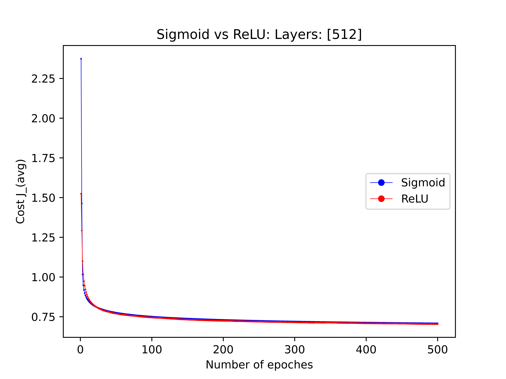
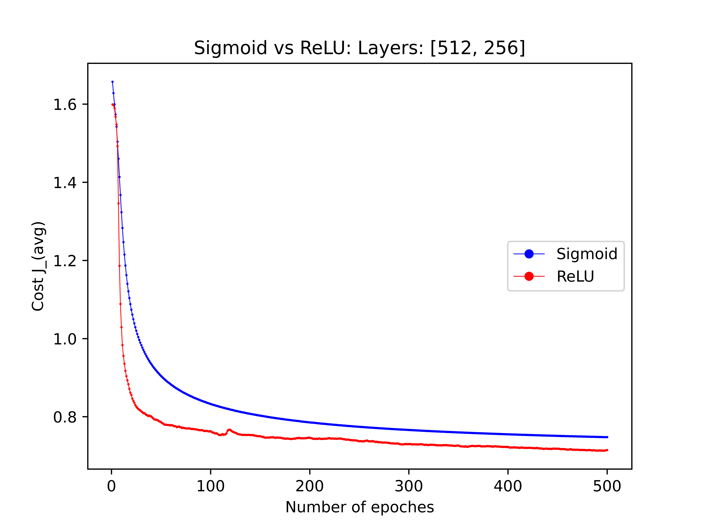
</p>

<p align="center">
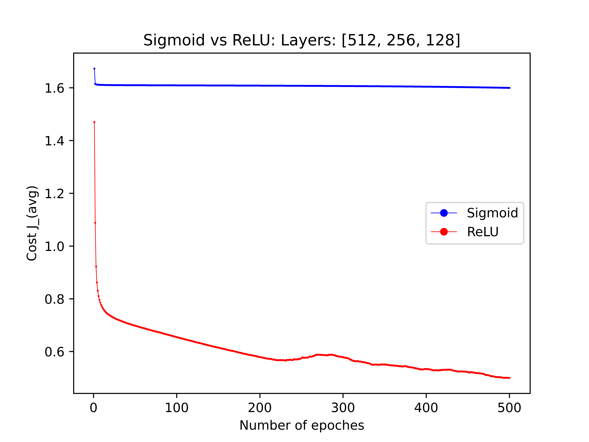
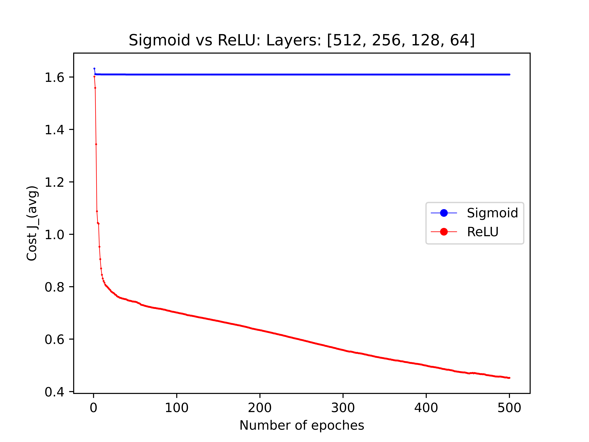
</p>

* Clearly ReLU outperforms Sigmoid in every case. The `loss of information` in deeper networks in Sigmoid is not a problem in ReLU as it `saturates` on only one side of $0$, as long as $\theta$ is in a certain region of space (atleast few components. Which is why it needs multiple trials to be initilised in the correct region), there is no information loss (on that particular perceptron), while also preserving `non linearity` (otherwise the entire Neural Network would just be a linear classifier)

* After training for $500$ epoches

* Training Data Scores (%)

|Layers|Precision|Recall|F1 Score|
|:-:|:-:|:-:|:-:|
|$[512]$ |$68.997$|$67.800$|$68.287$|
|$[512, 256]$ |$68.604$|$67.650$|$68.004$|
|$[512, 256, 128]$ |$81.366$|$81.090$|$81.214$|
|$[512, 256, 128, 64]$ |$81.908$|$81.430$|$81.564$|


* Testing Data Scores (%)

|Layers|Precision|Recall|F1 Score|
|:-:|:-:|:-:|:-:|
|$[512]$ |$67.377$|$66.900$|$67.054$|
|$[512, 256]$ |$66.098$|$66.200$|$66.104$|
|$[512, 256, 128]$ |$80.486$|$80.400$|$80.428$|
|$[512, 256, 128, 64]$ |$80.724$|$80.600$|$80.617$|

### F1 Score vs Network Depth

<p align="center">
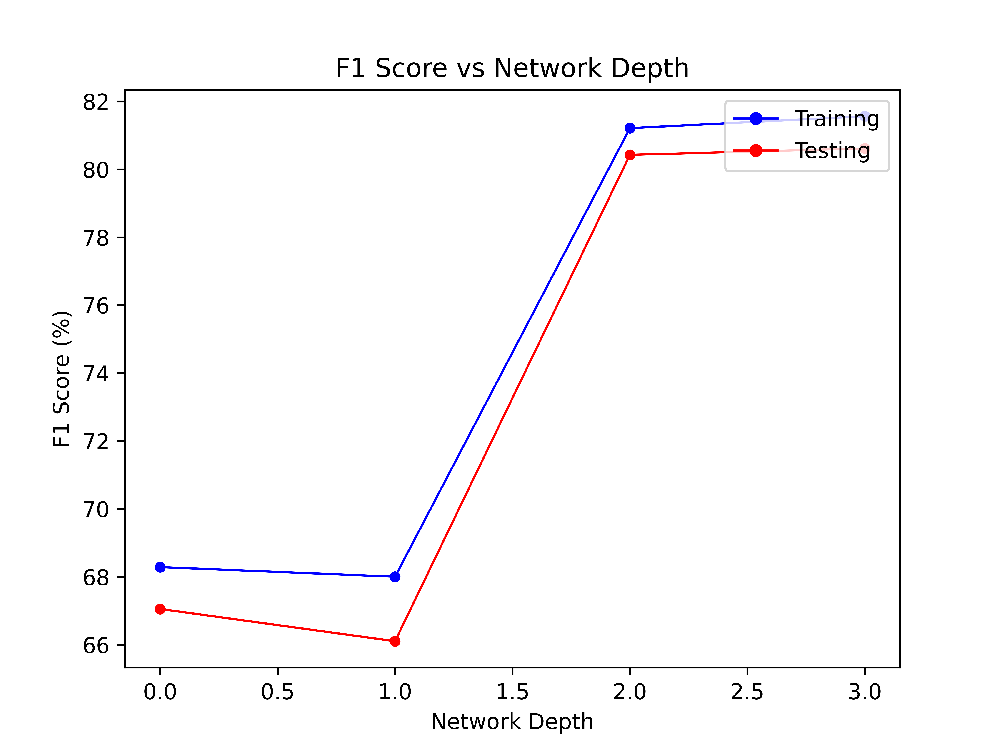
</p>


* ReLU obtains the same $J_{avg}$ values much faster than using `sigmoid` 

### Speed of Convergence: Sigmoid vs ReLU

* After $500$ epoches, Loss values

|Layers|Constant $\eta$| Adaptive $\eta$: Sigmoid |Adaptive $\eta$: ReLU| 
|:-:|:-:|:-:|:-:|
|$[512]$ |$0.6497$  | $0.7081$| $0.7039$|
|$[512, 256]$|$0.6257$ | $0.7477$|$0.7145$|
|$[512, 256, 128]$|$0.6544$| $1.5996$|$0.5000$|
|$[512, 256, 128, 64]$|$1.6103$ |$1.6093$|$0.4521$|

* Adaptive $\eta$ using Sigmoid Activation does worse than constant $\eta$ in all but the last row. This was justified in $(d)$.
* ReLU also suffers the same problem in the first $2$ rows but does far  better (much faster convergence) in the last $2$ rows. 

### F1 Score: Sigmoid vs ReLU

* F1 Scores After $500$ epoches on Test Set

|Layers| Sigmoid| ReLU|
|:-:|:-:|:-:|
|$[512]$ |$66.913$  | $67.054$| 
|$[512, 256]$|$66.724$ | $66.104$|
|$[512, 256, 128]$|$31.508$| $80.428$|
|$[512, 256, 128, 64]$|$31.508$ |$80.617$|

* ReLU does far better than Sigmoid in the last 2 cases. In the first, ReLU does better and in the second, Sigmoid does better but the difference is very slight. 


## (f) ReLU activation: SK Learn
* Training Settings:
```
clf = MLPClassifier(hidden_layer_sizes= hidden_layer_arch , activation= 'relu',
                        solver = 'sgd', alpha=0, batch_size = 32 , learning_rate='invscaling' , max_iter= 1000 , tol = 1e-6)
```


|Layers|`n_iter_`|Training time (hrs)|
|:-:|:-:|:-:|
|$[512]$ |$1000$|$1.01$|
|$[512, 256]$ |$1000$|$3.00$|
|$[512, 256, 128]$ |$1000$|$2.84$|
|$[512, 256, 128, 64]$ |$1000$|$2.90$|

* All of them hit the `max_iter = 1000` while training but training times are similar to those allowed in $(e)$


* Training Data Scores (%)

|Layers|Precision|Recall|F1 Score|
|:-:|:-:|:-:|:-:|
|$[512]$ |$63.402$|$59.240$|$60.704$|
|$[512, 256]$ |$63.245$|$61.480$|$62.189$|
|$[512, 256, 128]$ |$63.908$|$62.880$|$63.326$|
|$[512, 256, 128, 64]$ |$65.539$|$64.570$|$64.980$|


 

* Testing Data Scores (%)

|Layers|Precision|Recall|F1 Score|
|:-:|:-:|:-:|:-:|
|$[512]$ |$62.355$|$58.700$|$59.947$|
|$[512, 256]$ |$62.361$|$61.300$|$61.709$|
|$[512, 256, 128]$ |$63.413$|$63.100$|$63.186$|
|$[512, 256, 128, 64]$ |$64.720$|$64.500$|$64.603$|


  
<p align="center">
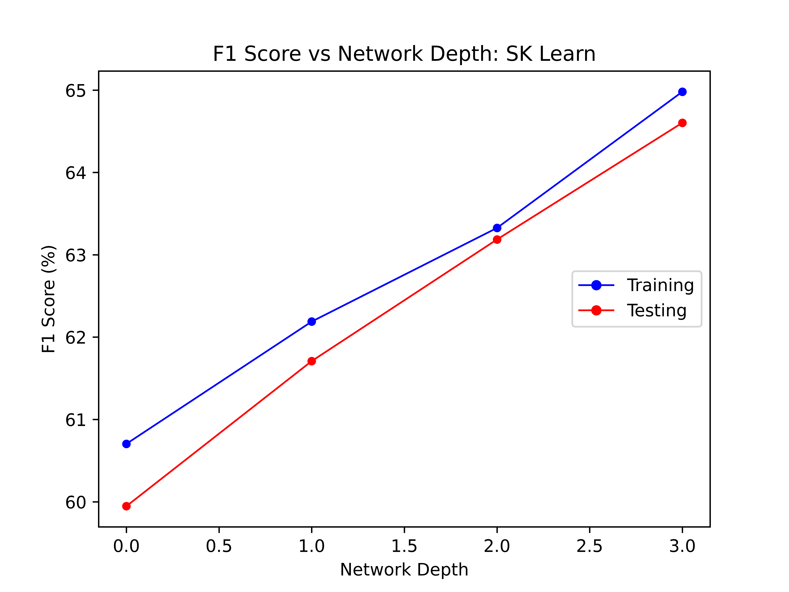
</p>


* Test Data F1 Score (%): ReLU: Scratch vs SK Learn
  
|Layers|Scratch|SK Learn|
|:-:|:-:|:-:|
|$[512]$ |$67.054$|$59.947$|
|$[512, 256]$|$66.104$|$61.709$|
|$[512, 256, 128]$ |$80.428$|$63.186$|
|$[512, 256, 128, 64]$ |$80.617$|$64.603$|

* Clearly, `scratch` outperforms `sk learn` in all $4$ cases. But this could be due to differing convergence criterial too. I also trained `sk learn` with `tol = 1e-4` in which case it convergs before hitting `max_iter`. The Scores in those cases were atmost $1$% - $2$% different from these. 


